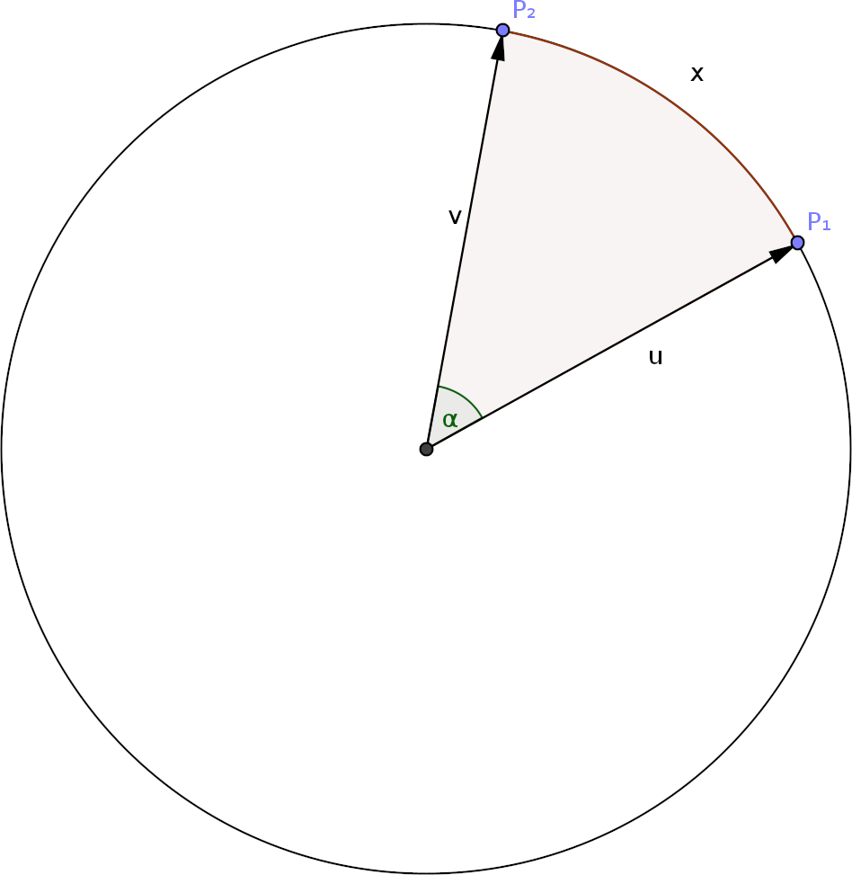
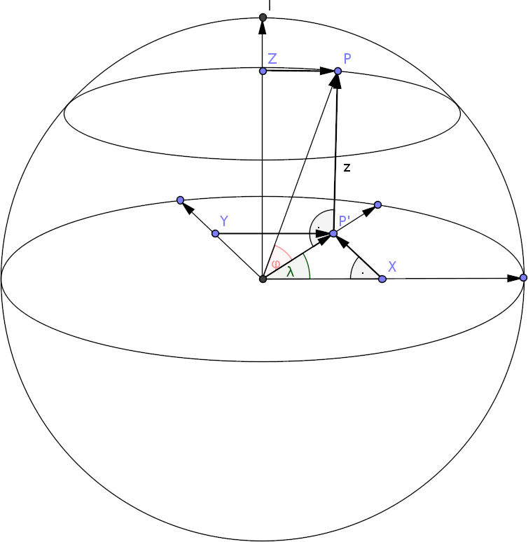

α
λ
φ

# Abstand und Projektion

## Abstand auf der Kugel

x = R α

<u, v> = |u||v|cos α

α = acos <u, v>/(R²)

## Umrechnung in Kartesische Koordinaten

<u, v> = x₀x₁ + y₀y₁ + z₀z₁

r' = R cos φ
z = R sin φ
y = r' sin λ = R cos φ sin λ
x = r' cos λ = R cos φ cos λ

## Projektion