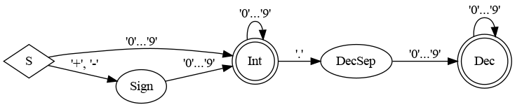

# Konfiguration

Das Parsen der Konfiguration ist in mehrere Abschnitte unterteilt.

## Beispiel

~~~~
// Konfiguration, Reihenfolge beliebig
config[projection] = "mercator"
config[bbox] = (12.8, 50.8, 13.0, 51.0)
config[outfile] = "map0.png"
include /* "datei1.cfg" */
  "datei2.cfg"
// Schrittbefehle, Reihenfolge wichtig
query[q1] = """
[bbox: {{box}}]
(
    way;
    >;
)
out qt
"""
draw[polygon] (
    style[basis] (stroke=#ff0000, linewidth=1.3)
    filter (("highway"=="primary" or highway=="secondary")
      and layer|0==0
    )
    id (1, 3)
)

query[q1]
// ...
~~~~

## Literatur

- [Aho et al: Compiler](https://www.pearson.de/compiler-9783863265748)
- [Nystrom: Crafting Interpreters](https://craftinginterpreters.com/)
- [Ball: Writing an Interpreter in Go](https://interpreterbook.com/)

## Tokens (1. Teil)

**Screencast** [Youtoube](https://youtu.be/CE_gtv5Mjow)

- Einzelzeichen: `[ ] ( ) = , |`
- Digrams: `== !=`
- Keywords: `config query draw filter style include and or xor not`
- Identifier: Buchstaben mit _, Zahlen, 1. Zeichen Buchstabe
- Zahlen: int, float mit Dezimalpunkt, Hexadezimalzahlen mit #

Definition im Paket `tokens`

## Lexer (2. und 3. Teil)

**Screencast**: [Youtube](https://youtu.be/c17gWghwUJs)

- Entfernen von Blanks und Kommentarten
- Einfache Zeichen und Digraphs
- Identifier, Schlüsselwörter, Zahlen, Strings

Definition im Paket `lexer`

## Erkennen von Zahlen, Identifier, Strings

**Screencast**: [Youtube](https://youtu.be/wtwZ2rnk3a0)

- endliche Automaten
- hier reguläre Ausdrücke:
  - Zahl: `[+-]?[0-9]+(\.[0-9]+)?`
  - Bezeichner: `[a-zA-Z_][a-zA-Z0-9_]*`

DFA für Zahlen:

## Grammatik (4. Teil)

**Screencast**: [Youtube](https://youtu.be/mhUmRQQhSfI)

Meta-Ausdrücke:

- `( )?`: wahlweise
- `( )*`: beliebig oft
- `//`: Kommentar bis Zeilenende

~~~
S = ( Entry )*

Entry = ConfigEntry
      | Include
      | QueryStep
      | DrawStep

ConfigEntry = "config" "[" ID "]" "=" ConfigValues

ConfigValues = ValueTuple
             | ValueSequence

ValueTuple = "(" Value ( "," Value )* ")"

ValueSequence = Value ( Value )

Value = STRING
      | INT
      | FLOAT
      | HEX

Include = "include" STRING ( STRING )*

QueryStep = "query" "[" ID "]" ( "=" STR )?

DrawStep = "draw" "[" ID "]" "(" ( DrawParam )* ")"

DrawParam = DrawStyle
          | TagFilter
          | IdFilter

DrawStyle = "style" ( "[" ID "]" )? "(" KV ("," KV)* ")"

KV = ID "=" ValueOrTuple

ValueOrTuple = Value
             | ValueTuple

TagFilter = "filter" "(" FilterExpr ")"

FilterExpr = TagTerm ( BinOp TagTerm )*  // liefert bool-Wert

TagTerm = TagCmp                         // liefert bool-Wert
        | "not" TagTerm
        | "(" FilterExpr ")"

TagCmp = TagOrDefault ( CmpValue )?      // liefert bool-Wert

TagOrDefault = ID ( "|" Value )?         // liefert string-Wert

CmpValue = CmpOp Value
         | "in" ValueTuple

CmpOp = "=="
      | "!="

BinOp = "and"
      | "or"

IdFilter = "osmId" ValueTuple // nur int-Werte erlaubt
~~~

## Parser 1 (5. Teil)

Implementieren des AST und der Befehle config, include, query

**Screencast**: [Youtube](https://youtu.be/iE3vd5zPCEI)

Beispiel:

~~~
config[bbox] = (13.9, 50.9, 14.1, 51.1)
query[empty] = "out qt"
~~~

AST-Struktur:

~~~mermaid
classDiagram

Ast *-- ConfigNode

Ast *-- StepNode

ConfigNode <-- ConfigEntry

class ConfigEntry{
  Key string
}

ConfigEntry *-- Values

StepNode <-- QueryStep

class QueryStep {
      Key string
      Value string
}

StepNode <-- DrawStep

DrawStep o-- StyleEntry

DrawStep -- TagFilter

class DrawStep

~~~

## Einlesen der Konfiguration (6. Teil)

Verarbeiten der `config`-Einträge einer Konfigurationsdatei

**Screencast** [Youtube](https://youtu.be/9IHtgFO_b60)

Nachträglich ergänzt:

- `config[projection]`
- Anpassung `Projection`: implementiert fmt.Stringer
