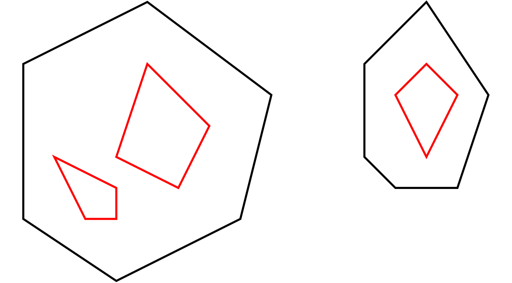

# Verbinden von Linien, Multipolygon

## Vorbereitungen

Falls ein neues Projekt erstellt werden soll, sind folgende Vorbereiungen
notwendig:

- Erstellen des neuen Projektverzeichnisses `07-multipolygon`
- Initialisieren des Projekts
  ~~~
  go mod init 07-multipolygon
  ~~~
- Anpassen aller Importe in den Quelldateien von `06-simpleshapes`
  auf `07-multipolygon`

## Wege verbinden

Teil 1: Ablauf, Hilfsfunktionen und Tests

**Screencast** [Youtube](https://youtu.be/4rAPhQv60ZI)

Teil 2: Verbinden der Wege, Auswertung Ergebnis

**Screencast** [Youtube](https://youtu.be/GZDkJaBnXzY)

*TODO*: mehrere Styles pro Zeichenschritt (einzeln auf jedes Element anwenden)

## Multipolygon

Dokumentation: [OSM-Wiki](https://wiki.openstreetmap.org/wiki/Relation:multipolygon)

Abfrage:

~~~
(
    rel[type='multipolygon'];
    way;
);
(
    ._;
    >;
);
out qt;
~~~

**Screencast**: [Youtube](https://youtu.be/ovUoZHsxcr4)

## Style-Vererbung

Erweiterung der Grammatik

~~~
...
Entry = ConfigEntry
      | StyleEntry
      | DrawStep
      | Include

StyleEntry = "style" "[" Id "]" "=" StyleTuple
...
~~~

**Screencast**: [Youtube](https://youtu.be/6CGrcZ3RR-A)

## LineCap und LineJoin

- Bug in Graphikbibliothek, wird in PNG nicht unterstützt
- Ziel: Test in anderen Ausgabeformaten

**Screencast**: [Youtube](https://youtu.be/vMVpAuu7htw)
